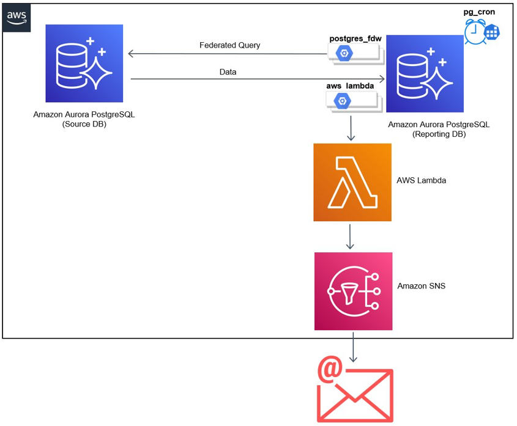

## Implement business logic in Amazon Aurora PostgreSQL using database stored procedures, federated queries, AWS Lambda and pg_cron

This repository contains code sample on how to build a framework using SQL and stored procedures, with the
support of Amazon Aurora PostgreSQL-Compatible Edition’s extensions postgres_fdw, pg_cron,
and aws_lambda. This is part of a blog and the detailed instructions to execute this code are available in the blog.

## Solution Architecture

## License
This library is licensed under the MIT-0 License. See the LICENSE file.